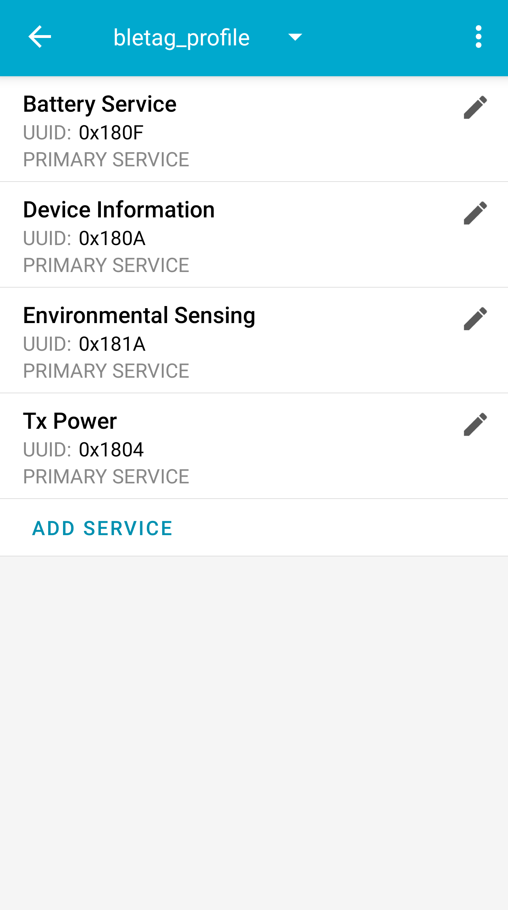

Examples
========

nRF Connect
-----------
.. note::

    The profile for nRF Connect application is in
    `bleico repo <https://github.com/Carglglz/bleico>`_ under
    ``examples/nRF_Connect`` directory

Put ``bletag_profile.xml`` in the mobile device and load the profile in
`Configure GATT server` option

This example demonstrates a simple ble tag
peripheral with the following structure:

  - Device Local Name: [MOBILE DEVICE]
  - Services:

      - (S) Device Information:

          - (C) Appearance
          - (C) Manufacturer Name String
          - (C) Model Number String
          - (C) Firmware Revision String

      - (S) Battery Service:

          - (C) Battery Level
          - (C) Battery Power State
      - (S) Environmental Sensing:

          - (C) Temperature
          - (C) Sensor location
      - (S) Tx Power:

          - (C) Tx Power Level

Enable the `Advertiser` and edit the advertising packet to set the
`Display Name`, `Advertising Data`, `Scan Response Data`
and check ``Connectable`` in options. Finally toggle advertising and run bleico.

When the connection is established, next to advertiser will appear the Connected
device (Central) and under `Server`, Characteristics values can be modified 🖊️ or
notifications/indications ⬆️ can be sent to the client.

.. warning::

    Be aware to write the values in the right format, otherwise data will appear
    as invalid, bleico will raise a wrong format error and a '?' symbol will be
    shown instead.

Esp32 (MicroPython)
-------------------

.. note::

    The script for this example is in
    `bleico repo <https://github.com/Carglglz/bleico>`_
    under ``examples/micropython_esp32`` directory

This example demonstrates a simple temperature sensor (esp32 cpu temperature)
peripheral with the following structure:

  - Device Local Name: esp32-batt-temp
  - Services:

      - (S) Device Information:

          - (C) Appearance
          - (C) Manufacturer Name String
          - (C) Model Number String
          - (C) Serial Number String
          - (C) Firmware Revision String
          - (C) Hardware Revision String
          - (C) Software Revision String
      - (S) Battery Service:

          - (C) Battery Level
          - (C) Battery Power State
      - (S) Environmental Sensing:

          - (C) Temperature
          - (C) Temperature Range

- *Connected Mode*:

    The sensor's local value updates every 30 seconds.
    When Battery Level is over 90 % or under 10 % it notifies the Client
    with the Battery Power State

- *Energy Save Mode*:

    To save Battery power,
    it will advertise for 30 seconds, if there is no connection
    event, it will enter into deep sleep for 60 seconds.
    If there is a connection event, it will enter the Connected Mode and
    if there is a disconnection event, it will enter into Energy Save Mode.

Once ``BLE_Battery_Temp`` class is initiated it will enter the Energy Save Mode.

.. note::

    ``Battery Level``  and  ``Temperature`` values are averaged over the
    previous 30 samples

Put ``ble_batt_cputemp.py`` in the device and add this in ``main.py`` :

.. code-block:: python

    import bluetooth
    from ble_batt_cputemp import BLE_Battery_Temp

    ble = bluetooth.BLE()
    ble_temp_batt = BLE_Battery_Temp(ble)

.. warning::

    The board used for this example is the
    `Adafruit feather huzzah32 <https://learn.adafruit.com/adafruit-huzzah32-esp32-feather/pinouts>`_
    .
    If using a different board, the ADC pin for battery readings should be adapted.
