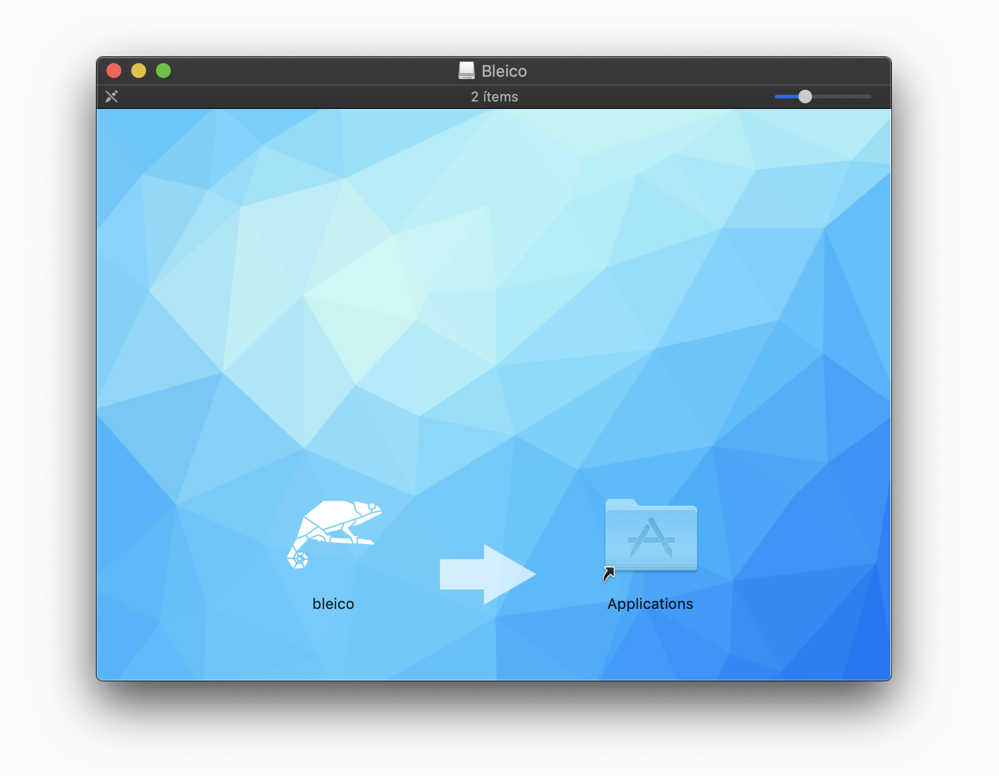

.. bleico documentation master file, created by
   sphinx-quickstart on Mon Sep  7 00:32:39 2020.
   You can adapt this file completely to your liking, but it should at least
   contain the root `toctree` directive.

Bleico
==================================

**Bluetooth Low Energy System Tray Utility**
--------------------------------------------
Bleico is a system tray application/tool to scan, connect, explore and debug
Bluetooth low energy devices which are compliant with
`SIG Bluetooth GATT Characteristics <https://www.bluetooth.com/specifications/gatt/characteristics/>`_.

It is based on `bleak <https://bleak.readthedocs.io/en/latest/>`_,
`bleak-sigspec <https://bleak-sigspec.readthedocs.io/en/latest/>`_ and
`PyQt5 <https://pypi.org/project/PyQt5/>`_

Bleico comes in two versions, as a command line tool e.g:

.. code-block:: console

    $ bleico -h
    usage: bleico [Mode] [options]

    Bluetooth Low Energy System Tray Utility

    positional arguments:
      Mode          Mode:
                    - config
                    - run

    optional arguments:
      -h, --help    show this help message and exit
      -v            show program's version number and exit
      -t T          device target uuid
      -s            show scanner with available devices
      -r R          read timeout in seconds
      -dflev DFLEV  debug file mode level, options [debug, info, warning, error, critical]
      -dslev DSLEV  debug sys out mode level, options [debug, info, warning, error, critical]

Or as a standalone application

The only difference is that with the command line tool, every event is logged to
the console so any error can be easily debbuged. .e.g:

.. code-block:: console

    $ bleico run

.. toctree::
   :maxdepth: 2
   :caption: Contents:

Indices and tables
==================

* :ref:`genindex`
* :ref:`modindex`
* :ref:`search`
