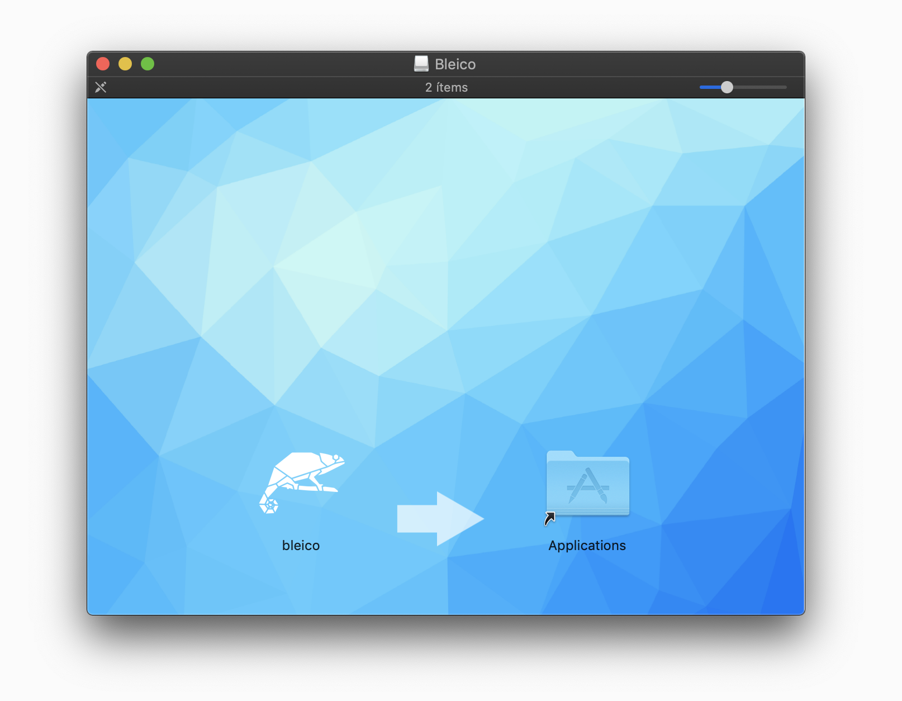

.. bleico documentation master file, created by
   sphinx-quickstart on Mon Sep  7 00:32:39 2020.
   You can adapt this file completely to your liking, but it should at least
   contain the root `toctree` directive.

Bleico
==================================
.. image:: img/bleico_logo.png
    :target: https://github.com/Carglglz/bleico
    :alt: Bleico Logo
    :align: center
    :width: 50%

**Bluetooth Low Energy System Tray Utility**
--------------------------------------------
Bleico is a system tray application/tool to scan, connect, explore and debug
Bluetooth low energy devices which are compliant with
`SIG Bluetooth GATT Characteristics <https://www.bluetooth.com/specifications/gatt/characteristics/>`_.

* Lincense: GPL-3.0
* Documentation: https://bleico.readthedocs.io.

It is based on `bleak <https://bleak.readthedocs.io/en/latest/>`_,
`bleak-sigspec <https://bleak-sigspec.readthedocs.io/en/latest/>`_ and
`PyQt5 <https://pypi.org/project/PyQt5/>`_

Features
--------
* Bluetooth Low Energy Scanner
* System Tray Menu with:
      * Icon according to Appearance characteristic (if present)
      * Device Name
      * Device UUID
      * Services and Characteristics menu tree
      * Device information (if present)
      * Readable and writeable Characteristics organised in sections by services
      * Read periodically from Characteristics
      * Write to Characteristics (from menu or dialog box)
      * Enable desktop notifications on notifiable Characteristics
      * Configurable tool tip
      * Last update, Connection and RSSI status
      * Desktop Notification on Connection status changes.
      * Automatic Reconnection on disconnect, in 30 seconds cycles until reconnected.

Command Line Tool vs Standalone Application
-------------------------------------------

Bleico comes in two versions, as a command line tool e.g:

.. code-block:: console

    $ bleico -h
    usage: bleico [Mode] [options]

    Bluetooth Low Energy System Tray Utility

    positional arguments:
      Mode          Mode:
                    - config
                    - run

    optional arguments:
      -h, --help    show this help message and exit
      -v            show program's version number and exit
      -t T          device target uuid
      -s            show scanner with available devices
      -r R          read timeout in seconds, default: 1
      -dflev DFLEV  debug file mode level, options [debug, info, warning, error, critical]
      -dslev DSLEV  debug sys out mode level, options [debug, info, warning, error, critical]

Or as a standalone application

The only difference is that with the command line tool, every event is logged to
the console so any error can be easily debbuged. .e.g:

.. code-block:: console

    $ bleico run
    ************************************************************

    $$$$$$$\  $$\       $$$$$$$$\ $$$$$$\  $$$$$$\   $$$$$$\
    $$  __$$\ $$ |      $$  _____|\_$$  _|$$  __$$\ $$  __$$\
    $$ |  $$ |$$ |      $$ |        $$ |  $$ /  \__|$$ /  $$ |
    $$$$$$$\ |$$ |      $$$$$\      $$ |  $$ |      $$ |  $$ |
    $$  __$$\ $$ |      $$  __|     $$ |  $$ |      $$ |  $$ |
    $$ |  $$ |$$ |      $$ |        $$ |  $$ |  $$\ $$ |  $$ |
    $$$$$$$  |$$$$$$$$\ $$$$$$$$\ $$$$$$\ \$$$$$$  | $$$$$$  |
    \_______/ \________|\________|\______| \______/  \______/

    ************************************************************
    2020-09-10 22:27:20,153 [bleico] [MainThread] [INFO] Running bleico 0.0.1
    2020-09-10 22:27:23,544 [bleico] [MainThread] [INFO] Connected to: 9998175F-9A91-4CA2-B5EA-482AFC3453B9
    2020-09-10 22:27:24,540 [bleico] [MainThread] [INFO] Device esp32-batt-temp found
    2020-09-10 22:27:24,541 [bleico] [MainThread] [INFO] Services:
    2020-09-10 22:27:24,541 [bleico] [MainThread] [INFO]  (S) Device Information
    2020-09-10 22:27:24,541 [bleico] [MainThread] [INFO]  (C)  - Appearance
    2020-09-10 22:27:24,541 [bleico] [MainThread] [INFO]  (C)  - Manufacturer Name String
    2020-09-10 22:27:24,541 [bleico] [MainThread] [INFO]  (C)  - Model Number String
    2020-09-10 22:27:24,541 [bleico] [MainThread] [INFO]  (C)  - Serial Number String
    2020-09-10 22:27:24,541 [bleico] [MainThread] [INFO]  (C)  - Firmware Revision String
    2020-09-10 22:27:24,541 [bleico] [MainThread] [INFO]  (C)  - Hardware Revision String
    2020-09-10 22:27:24,541 [bleico] [MainThread] [INFO]  (C)  - Software Revision String
    2020-09-10 22:27:24,541 [bleico] [MainThread] [INFO]  (S) Battery Service
    2020-09-10 22:27:24,542 [bleico] [MainThread] [INFO]  (C)  - Battery Level
    2020-09-10 22:27:24,542 [bleico] [MainThread] [INFO]  (C)  - Battery Power State
    2020-09-10 22:27:24,542 [bleico] [MainThread] [INFO]  (S) Environmental Sensing
    2020-09-10 22:27:24,542 [bleico] [MainThread] [INFO]  (C)  - Temperature
    2020-09-10 22:27:24,542 [bleico] [MainThread] [INFO]  (C)  - Temperature Range
    2020-09-10 22:27:24,542 [bleico] [MainThread] [INFO] Device: esp32-batt-temp, UUID: 9998175F-9A91-4CA2-B5EA-482AFC3453B9
    2020-09-10 22:27:24,542 [bleico] [MainThread] [INFO] Device Information:
    2020-09-10 22:27:24,542 [bleico] [MainThread] [INFO]     - Appearance: Generic Thermometer
    2020-09-10 22:27:24,542 [bleico] [MainThread] [INFO]     - Manufacturer Name : Espressif Incorporated
    2020-09-10 22:27:24,542 [bleico] [MainThread] [INFO]     - Model Number : ESP32 module with ESP32
    2020-09-10 22:27:24,542 [bleico] [MainThread] [INFO]     - Serial Number : 30:AE:A4:23:35:64
    2020-09-10 22:27:24,543 [bleico] [MainThread] [INFO]     - Firmware Revision : micropython-1.13.0
    2020-09-10 22:27:24,543 [bleico] [MainThread] [INFO]     - Hardware Revision : esp32
    2020-09-10 22:27:24,543 [bleico] [MainThread] [INFO]     - Software Revision : 3.4.0
    2020-09-10 22:27:24,552 [bleico] [MainThread] [INFO] Multithreading with maximum 4 threads
    2020-09-10 22:27:24,687 [bleico] [MainThread] [INFO] [Battery Service] Battery Level: 96 %
    2020-09-10 22:27:24,687 [bleico] [MainThread] [INFO] [Environmental Sensing] Temperature: 25.03 °C
    2020-09-10 22:27:24,688 [bleico] [MainThread] [INFO] [Environmental Sensing] Temperature Range Minimum Temperature: 15.0 °C
    2020-09-10 22:27:24,688 [bleico] [MainThread] [INFO] [Environmental Sensing] Temperature Range Maximum Temperature: 28.0 °C
    2020-09-10 22:27:25,782 [bleico] [MainThread] [INFO] [Battery Service] Battery Level: 96 %
    2020-09-10 22:27:25,782 [bleico] [MainThread] [INFO] [Environmental Sensing] Temperature: 25.03 °C
    2020-09-10 22:27:25,782 [bleico] [MainThread] [INFO] [Environmental Sensing] Temperature Range Minimum Temperature: 15.0 °C
    2020-09-10 22:27:25,782 [bleico] [MainThread] [INFO] [Environmental Sensing] Temperature Range Maximum Temperature: 28.0 °C

Installation
------------
Command Line Tool
^^^^^^^^^^^^^^^^^
  Install ``bleico`` by running:

  .. code-block:: console

      $ pip install bleico

  Or get latest development version:

  .. code-block:: console

      $ pip install https://github.com/Carglglz/bleico/tree/develop.zip

Standalone Application
^^^^^^^^^^^^^^^^^^^^^^
  Download from `Releases <https://github.com/Carglglz/bleico/releases/new>`_:

  - MacOS:
      * bleico_img.dmg

  - Windows: (Not available yet)

  - Linux: (Not available yet)
