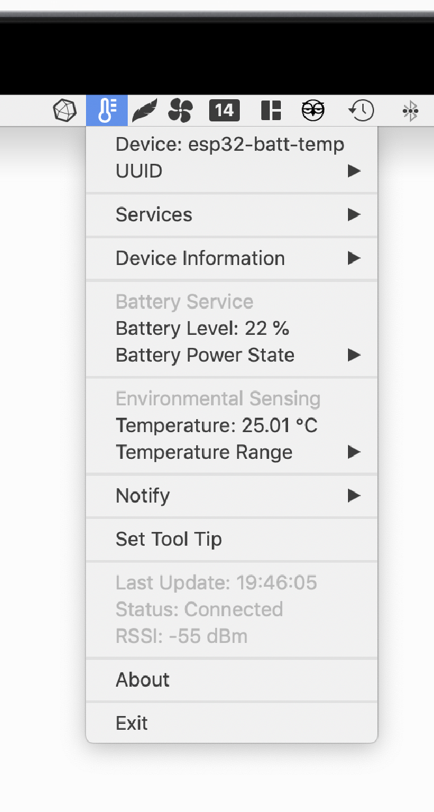
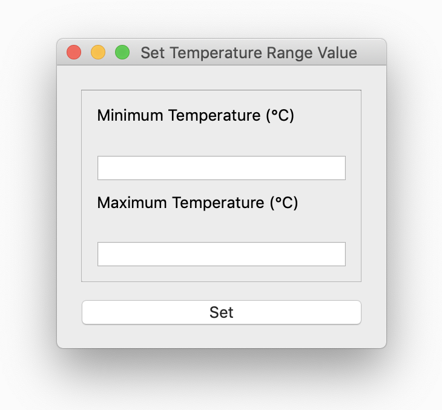
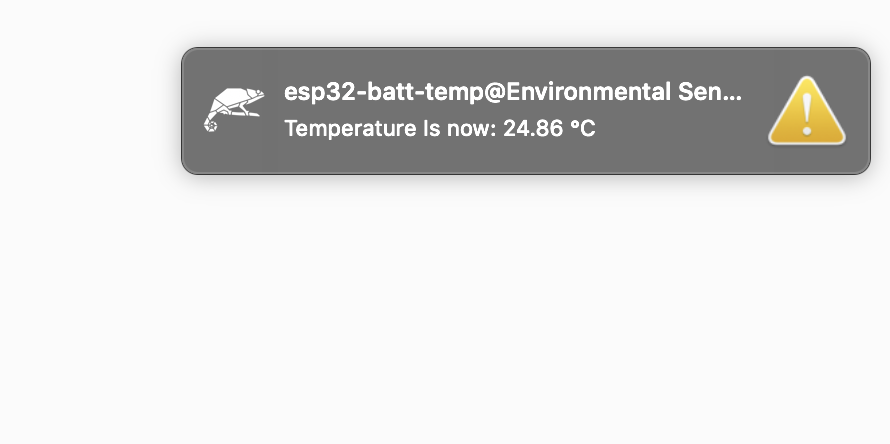
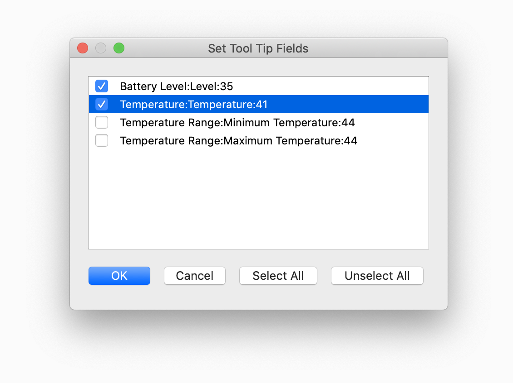
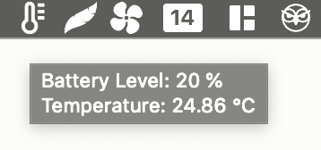

Usage
=====

Once the device is connected, an icon will appear in the system tray/menu bar
according to device Appearance characteristic (if present). If this
characteristic is not present, a generic rhomb (♢) will appear instead.

Reading Characteristics
-----------------------

Readable Characteristics are read periodically (every second by default).
Those characteristics with a single field, its value will appear in the main menu,
otherwise they will be in a submenu.

Writing Characteristics
-------------------------

Writeable Characteristics appear in the main menu as *Set [Characteristic]* or
if it is readable too and it has multiple fields in its submenu, as *Set Value*.
If the writeable characteristic has a single field with enumerations, will appear
as a submenu to select, otherwise a *Set Value* dialog with characteristics fields
will appear.

Notify Characteristics
----------------------

Notifiable Characteristics will appear in *Notify* submenu where notify sound
can be toggled (for all desktop notifications) as well as enabling/disabling
notification in each characteristic (with a option for desktop notification too)

Set Tooltip
----------------------

The icon tooltip can be customised, to include whatever combination of
characteristics (readable or notifiable). To select them, a dialog box with
checkable items will appear.

Connection Status
----------------------

Connection status is checked every second, and *Last Update* corresponds to last
time the connection was checked. If the device is disconnected, a desktop
notification will appear. Bleico will try to reconnect immediately, and if it
fails, bleico will try to reconnect every 30 seconds until it can connect again.
If the connection is successful a desktop notification will appear, and bleico
will return to normal operation.
